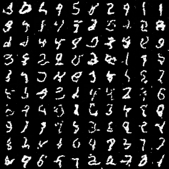

# nanoDiffusion

The simplest diffusion model in PyTorch, with Apple M chip acceleration support.

Training a decent model on MNIST only takes 10~30 minutes on a MacBook!  

Supported sampler:
 - DDPM ("Denoising Diffusion Probabilistic Models")
 - DDIM ("Denoising Diffusion Implicit Models")

# Quick start

First we need to download the MNIST dataset. Simply run

```sh
python data.py
```

and you will get the compressed MNIST dataset downloaded in `data` folder.

After getting the training data, we can check how the noise adding process works by running the following command:

```sh
python sampler.py
```

Note that the noise-adding process is sampler-invariant. Here's an example image:


You can train the diffusion model (a small UNet) and generate new images by running the following command:

```sh
python main.py
```

You can set `train_model = False` to skip the training process by loading the model checkpoint. Below are some examples generated by different sampler.

### DDPM, 100 epoch training, 1000 sample steps, 


### DDIM, 100 epoch training, 100 sample steps, 0 eta



## Acknowledgements

`SingleZombie/DL-Demos` provided some insights for me to implement the pipeline. Thanks Yifan!